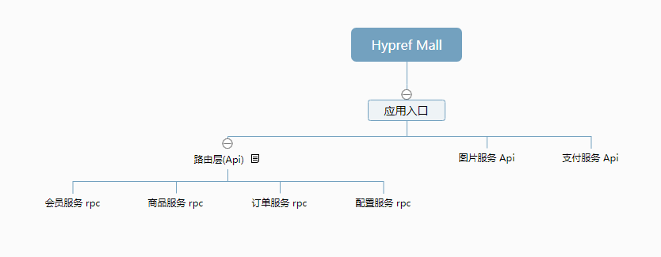
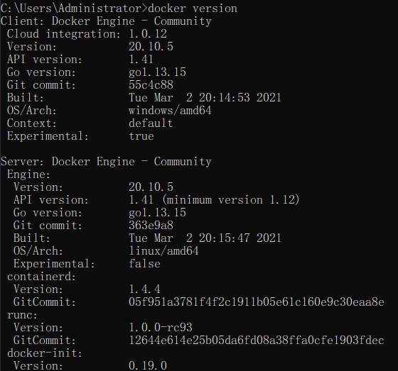

# Hypref Mall

#### 介绍
Hypref Mall是开源的微服务商城系统

#### 软件架构

#### 安装说明
##### 第一次安装会比较耗时，建议使用自带脚本工具进行安装，整个过程需要10-30分钟！！

1.  提前准备好Docker、Python3、MySQL、Redis。
2.  代码下载

    仓库地址：

            1. 路由层：xxxxx----xxxxx@gitee.com

            2. 图片API:

            3. 支付API:

            4. 配置服务

            5. 商品服务

            6. 订单服务

            7、会员服务

            8、uniapp端 生成小程序

            9、admin后台管理

    或者：进入到安装目录后执行一键下载脚本 ./install.py

3.  初始化DB信息，执行 ./initDb.py

4.  本地确认docker部署完毕：

执行 ./initDocker.py 一键生成 docker容器

5.  服务compoer安装vendor扩展(可能会比较耗时)

执行 ./initVendor.py 一键安装 或者进入单个容器中，进入项目目录下:composer install

6.  修改项目下env配置文件，或者执行 ./initEnv.py 一键修改

7.  执行 hypref_mall_service.exe 根据命令一键启动所有服务

#### 使用说明

1.  基于Hypref框架 ，代码完全免费开源！

#### 特点

1.  简化微服务复杂的配置与调用，像开发单应用一样开发微服务系统！

2.  封装很多提升开发速度的工具，服务端一键生成对外初始增删改查的服务RPC，路由层一键生成微服务的各项配置...
