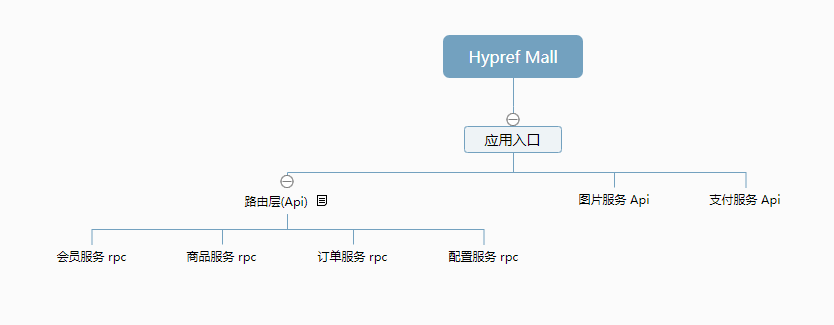

# Hypref Mall

#### 介绍
Hypref Mall 是一套开源的高性能微服务商城系统。是一款高扩展、高性价比的企业级应用。实现通用的商品、购物车、订单、支付等购物流程，封装了大量易用的基础方法，可以用来学习，也可以用来做二次开发。


#### 软件架构



#### 安装说明
##### 第一次安装会比较耗时，建议使用自带脚本工具进行安装，整个过程需要10-30分钟！！

    提前准备好Docker. 默认端口占用:5503-5508 5566-5568。

i. 自动安装(推荐)
   1. windows 下 运行install目录下的 hypref_mall_service.exe 命令``99``一键安装
   2. linux 下 执行 python ./main.py (python版本 > 3.0)
    运行后如下图：
   

   安装完成测试接口:http://127.0.0.1:5566/app/index/index 

ii. 手动安装

    1. 代码下载， 仓库地址：

            1. 路由层：https://gitee.com/scwlkj/hypref_mall_admin.git

            2. 图片API:https://gitee.com/scwlkj/hypref_mall_images.git

            3. 支付API：https://gitee.com/scwlkj/hypref_mall_pay.git

            4. 配置服务：https://gitee.com/scwlkj/hypref_mall_config.git

            5. 商品服务：https://gitee.com/scwlkj/hypref_mall_goods.git

            6. 订单服务:https://gitee.com/scwlkj/hypref_mall_order.git

            7. 会员服务:https://gitee.com/scwlkj/hypref_mall_member.git
        
        下载对应的项目代码    

    2. docker部署：

        其中：“D:\\project\\xxx\\xxx” 为本地项目路径 --name xxx 为 容器名

        命令：```docker run -v D:\\project\\xxx\\xxx:/data/project --name xxxx  -p 5566:5566 -it --privileged -u root --entrypoint /bin/sh         hyperf/hyperf:7.4-alpine-v3.11-swoole```


    3. 安装项目vendor扩展(相对比较耗时)

        进入容器的项目根目录下执行:composer install

    4. 初始化数据表

        sql脚本地址：项目下 -> static/SQL/sql.sql

    5. 修改env配置文件
       1. 修改数据库，填写自定义的数据库信息
       2. 修改redis信息
       3. 修改服务相关服务的IP和PORT.

    6. 启动所有服务


#### 使用说明

1. 基于Hypref框架 ，代码完全免费开源！
2. 要求 PHP 版本 >= 7.4
3. 要求 MySQL 版本 >= 5.7
4. 要求 Redis 版本 >= 5.2
5. 一键安装时通过修改配置文件，实现自定义服务端口、服务名、数据库、地址等信息
6. 当前项目为纯后端Api接口，小程序端用uniapp实现，查看源码，请跳转至：xxx 查看
7. 管理后台代码目前开发中，开发进度30%，预计2-3个月会完成并全部开源

#### 特点

1. 简化微服务的配置与调用过程，像开发单应用一样开发微服务系统！

2. RPC服务内置生成基于单个数据表，对外提供的增删改查服务命令.

3. 路由服务内置生成 服务间调用的配置 命令，免去每个接口都手动去配置一遍的烦恼，让关注点聚焦业务.
4. 基于Hypref，具有高性能、高并发处理优势，具备协程级控制，服务的注册、接口限流、接口熔断、服务监控等。
