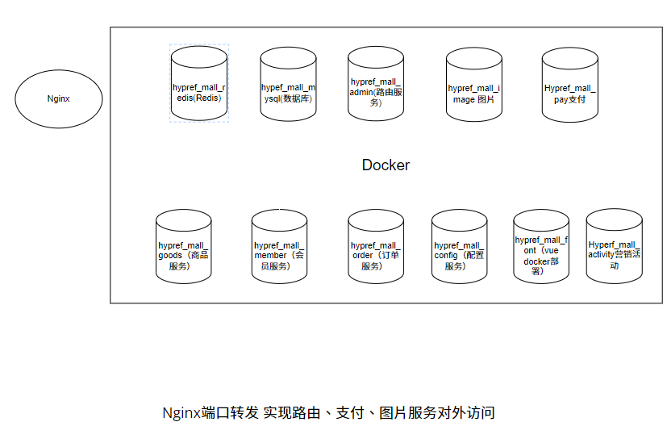

# Hyperf Mall

### 介绍
Hyperf Mall 是一套开源的高性能微服务商城系统。是一款高扩展、高性价比的企业级应用。实现通用的商品、购物车、订单、支付等购物流程，封装了大量易用的基础方法，可以用来学习，也可以用来做二次开发。

### 项目初衷
1. 简化微服务的配置与调用过程，像开发单应用一样开发微服务系统！
2. 自带高并发、大数据、大流量的解决方案。

### 部署说明

### 安装说明

    提前需备必要环境：Git、Docker, Node >= v10.21.0. 系统默认占用端口:5503-5509 5566-5569。

   1. windows系统，下载install目录的 Hyperf_mall_service.exe 到本地，双击运行，根据提示输入命令``99``执行一键安装。
   2. linux系统，下载install目录下的python代码，执行 python ./main.py (python版本 > 3.0)，根据提示输入命令``99``执行一键安装。
    运行后如下图：
  
   

- 安装完成后,访问C端接口:http://127.0.0.1:5566/app/index/index  测试是否连通
- 管理后台地址：http://127.0.0.1:5569 账号:admin 密码:123456

### 使用说明

1. 基于Hyperf框架 ，代码完全免费开源！
2. 要求 PHP 版本 >= 7.4
3. 要求 MySQL 版本 >= 5.7
4. 要求 Redis 版本 >= 5.2

### 小程序端

体验传送门：暂无

[线上小程序端地址](https://gitee.com/scwlkj/hypref_mall_wechat) 

### 管理后台

体验传送门：https://admin.51job.top

[管理后台地址 ](https://gitee.com/scwlkj/hypref_mall_font)

### 特色

1. RPC服务内置一键生成命令，生成基于单个数据表，对外提供的增删改查服务命令.
2. 路由服务内置一键生成 服务间调用的配置 命令，免去每个接口都手动去配置一遍的烦恼，让关注点聚焦业务.
3. 基于Hyperf，具有高性能、高并发处理优势，具备协程级控制，服务的注册、接口限流、接口熔断、服务监控等。

### 小程序端预览

### 管理后台预览

